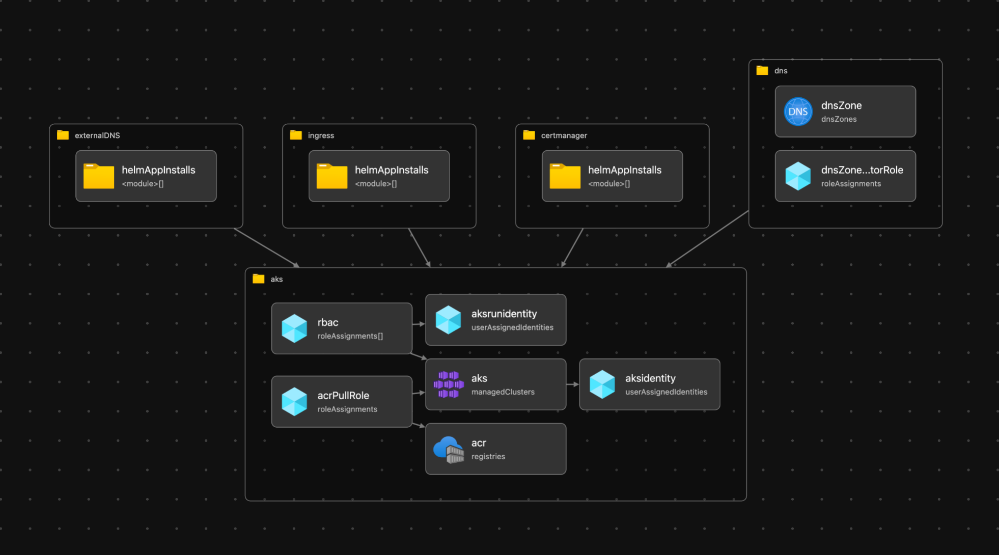

# aks-maffe-maandag

De [Maffe Maandag van 12 december](https://github.com/VXCompany/maffe-maandag-12-2022) staat in het thema van Value Proposition Design, Liberating Structures, Micro-Front-ends met NX, Kubernetes, en GitHub Actions.

We hebben tot nu toe een Value Proposition map, een backlog en een app gebouwd. De volgende stap is om deze te runnen op Kubernetes en te deployen via GitHub Actions. Daar gaan we deze repo voor gebruiken.

## Aparte infra repo
Op dit moment staat deze repo volledig op zichzelf, en de connectie tussen jullie vorige werk en de deployment is op basis van Docker Images. Dat is op dit moment een bewuste keuze, ook om de ontwikkeling van deze setup async te kunnen laten verlopen.

## Bicep
Als IaC tool maken we gebruik van Bicep. Dit zorgt ervoor dat de infra gemakkelijk is aan te passen via de pipeline en makkelijk te reproduceren is voor andere omgevingen.

Helaas is de Kubernetes provider nog niet uit voor Bicep, waardoor het Kubernetes gedeelte als YAML is geconfigureerd en apart moet worden gedeployed.

Een overzicht met de Bicep Visualizer:

## Kubernetes
Als runtime voor de applicatie maken we gebruik van Kubernetes, en specifiek AKS. AKS is [hier](https://github.com/aristosvo/aks-maffe-maandag/blob/main/modules/aks.bicep) gedefinieerd in Bicep, configuratie van het cluster qua system tooling via Helm Charts (in Bicep) staat [hier](https://github.com/aristosvo/aks-maffe-maandag/blob/7aaf119cfde0bcc26661256738c55e8cd57f163c/main.bicep#L23-L78) en configuratie op app level via Kubernetes Config [hier](https://github.com/aristosvo/aks-maffe-maandag/tree/main/kubernetes/apps).

## GitHub Actions
Om de Bicep IaC en de applicaties te deployen wordt gebruik gemaakt van GitHub Actions. De GitHub Actions workflows zijn [hier](https://github.com/aristosvo/aks-maffe-maandag/tree/main/.github/workflows) gedefinieerd in YAML.

## Wat nu?
- [Hoe is dit AKS Cluster nou eigenlijk geconfigureerd?](./docs/AKS.md)
- [Hoe kan ik er voor zorgen dat mijn Micro Frontend wordt getoond?](./docs/LetsDoIt.md)