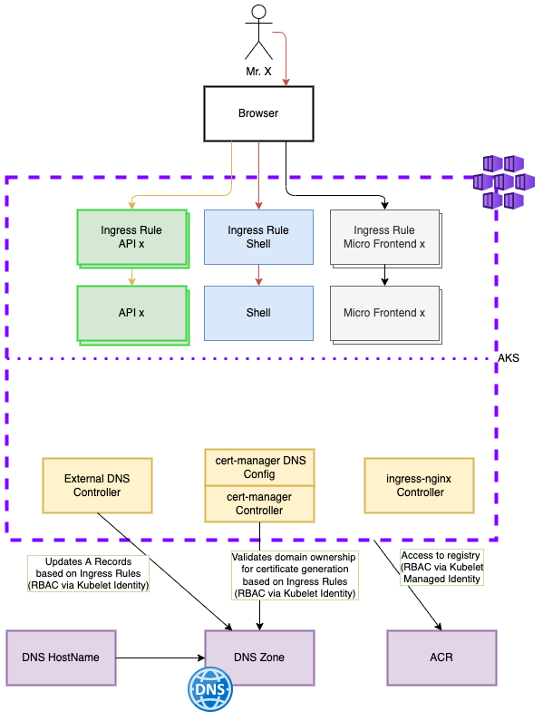
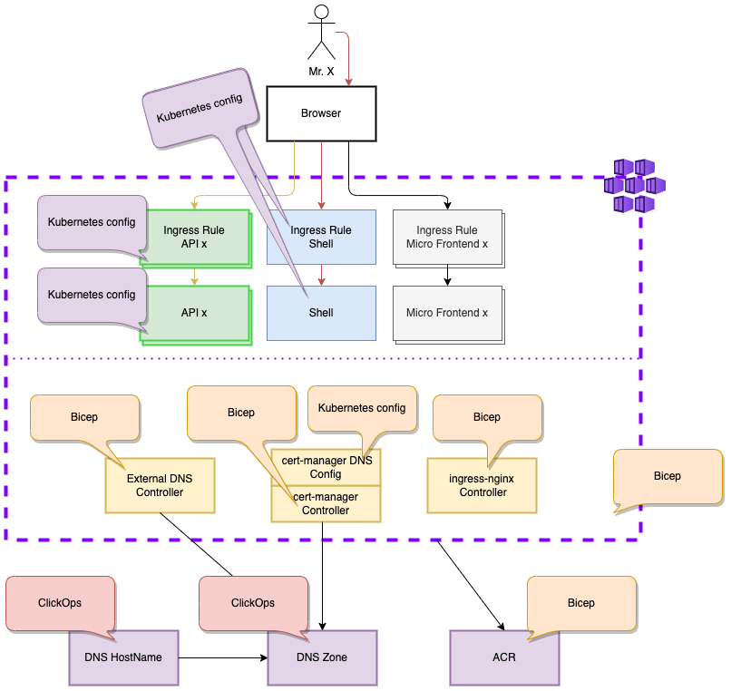

# AKS System Configuratie Overzicht
Hoe zit het nu allemaal in elkaar? Hoe kom je tot een cluster die 'simpel' is voor de applicatie engineer en onderhoudbaar voor de platform engineer?

**Disclaimer:** De cluster configuratie is geen eindstaat, maar laat wel de mindset zien.

## Loadbalancing, certificaten en DNS!
Het AKS cluster is zo opgezet dat taken zoals load balancing, certificaten en DNS inregelen voor de verschillende app componenten automatisch gaat.

Via Helm Charts geconfigureerd in Bicep worden ingress rules omgezet in de verschillende onderdelen:
| Onderdeel  | Helm Chart    | Externe docs|
|     --     |       --      | --
|nginx config + LB + routing|`ingress-nginx`| [link](https://kubernetes.github.io/ingress-nginx/)
|Certificaten|`cert-manager` | [link](https://cert-manager.io/docs/)
|DNS records |`external-dns` | [link](https://github.com/kubernetes-sigs/external-dns)

## Deployment pipelines (en een beetje ClickOps)
De meeste onderdelen worden via Bicep of Kubernetes Configuratie YAML gedeployed.

| Deployment     | Onderdelen|
|        --      | --
| ClickOps (rood)| DNS domein (mijndomein.nl) en DNS Zone (Azure DNS zone `maffe-maandag.nl` in resource group `dns`)
| Bicep (oranje) | AKS, ACR, Helm charts via Bicep (en klein beetje Kubernetes Config) in [deze pipeline](./.github/workflows/arm-deploy.yml)
| Kubernetes Config (paars)|Alle app componenten, via Kubernetes Configuratie in [deze pipeline](./.github/workflows/apps-deploy.yml)

## Wat nu?
- [Top](#aks-system-configuratie-overzicht)
- [Hoe kan ik er voor zorgen dat mijn Micro Frontend wordt getoond?](./LetsDoIt.md)
- [Terug naar het Overzicht](../README.md)