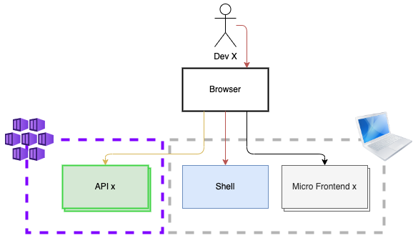
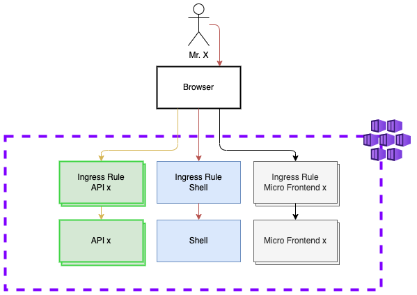

# Hoe deployen we jullie Micro Frontends?

|Startpunt (dit grijze gedeelte hebben jullie gemaakt) |..en hier willen we naar toe! 
|--|--|
||

## Wat ontbreekt:
- [ ] Tot nu toe zijn de MF Docker containers alleen lokaal gedraaid, ze moeten óf ergens publiek komen te staan óf in de Azure Container Registry van het cluster komen.
- [ ] Tot nu toe hadden we een default Shell, we moeten een Shell hebben met alle MF's. Deze moet óf ergens publiek komen te staan óf in de Azure Container Registry van het cluster komen.
- [ ] De pipeline voor het app gedeelte deployed op dit moment een (default) Shell en de API's. We hebben een Shell deployment nodig van de complete Shell.
- [ ] Van de Micro Frontends is de Welkom page gedeployed, maar meer ook niet. We hebben al jullie MF's als deployment nodig in AKS.


## Let's do it! (1)

We gaan in eerste instantie zorgen dat de containers beschikbaar worden. Wie gaat dit doen en op welke manier?

<details>
  <summary>Example GitHub Action Docker push with Federated Identity</summary>

  ```yaml
  name: Build Containers and push to ACR
  on:
    push:
      branches: [main]
      # paths:
      #   - 'app'

  permissions:
        id-token: write
        contents: read
  jobs: 
    build-and-deploy:
      runs-on: ubuntu-latest
      steps:
        - name: 'Az CLI login'
          uses: azure/login@v1
          with:
            client-id: ${{ secrets.AZURE_CLIENT_ID }}
            tenant-id: ${{ secrets.AZURE_TENANT_ID }}
            subscription-id: ${{ secrets.AZURE_SUBSCRIPTION_ID }}
    
        - name: docker login, build and push
          run: |
            az acr login -n ${{ secrets.ACR }} 
            docker build ${{ env.TARGET_DIR_BUILD }} -t ${{ secrets.ACR }}.azurecr.io/${{ env.IMAGE_NAME }}:${{ github.run_number }}
            docker push ${{ secrets.ACR }}.azurecr.io/${{ env.IMAGE_NAME }}:${{ github.run_number }}
          env:
            IMAGE_NAME: example_image_name
            TARGET_DIR_BUILD: ./app
            TARGET_DOCKER_FILE: Dockerfile.app
  ```

</details>

## Let's do it! (2)

We moeten de applicatie deployments definieren voor de verschillende MF en de bestaande Shell deployment aanpassen. Wie gaat dit doen en op welke manier?

## Wat nu?
- [Top](#hoe-deployen-we-jullie-micro-frontends)
- [Ff kijken wat het resultaat is natuurlijk!](https://www.maffe-maandag.nl)
- [Terug naar het Overzicht](../README.md)